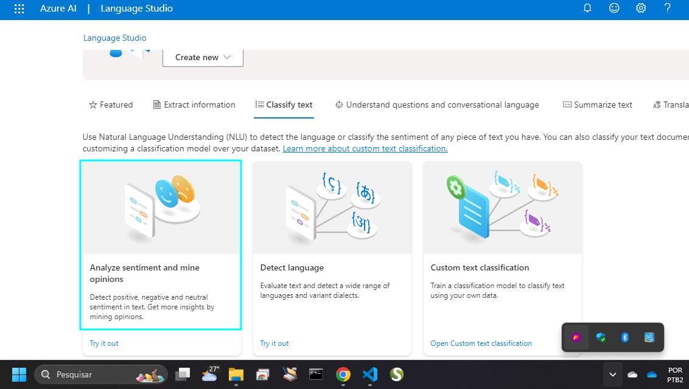
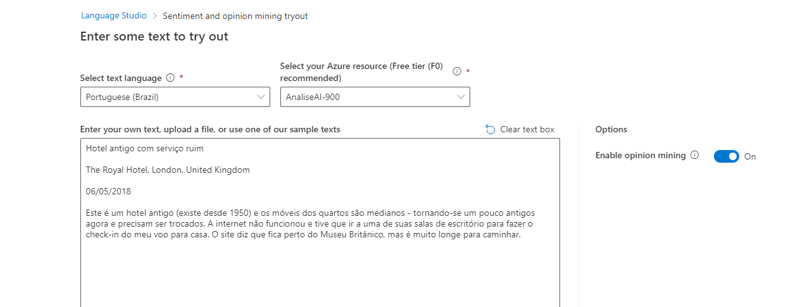
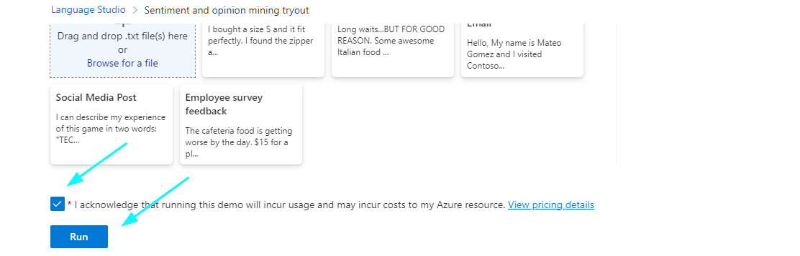
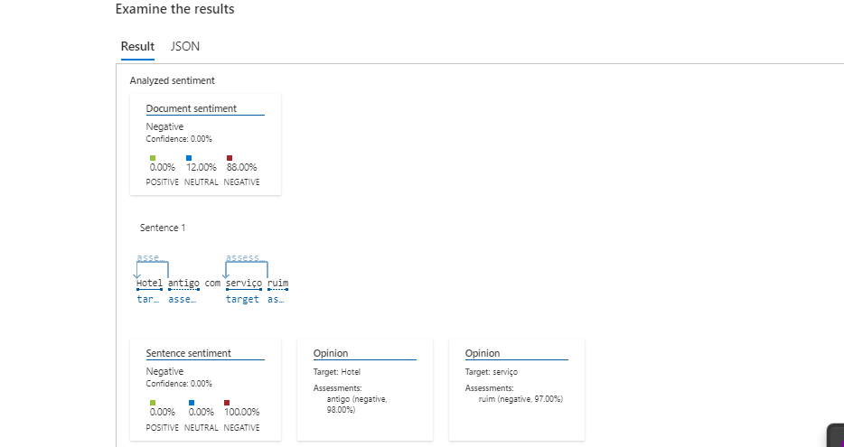
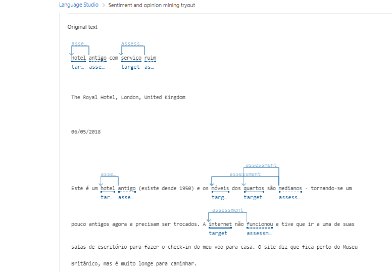

# Análise de Sentimentos com Language Studio

Neste exercício, você explorará as capacidades do Azure AI Language analisando algumas avaliações de hotéis.

O processamento de linguagem natural (NLP) é uma área da IA que lida com linguagem escrita e falada, permitindo extrair significados semânticos do texto ou discurso.

O serviço Azure AI Language inclui recursos de análise de texto e NLP, como identificação de frases-chave e classificação de texto com base em sentimentos.

Para realizar a análise, é necessário criar um recurso de Linguagem no Azure. Isso pode ser feito acessando o portal Azure em https://portal.azure.com, criando um recurso de Linguagem e configurando-o com as especificações necessárias, como região, nome e nível de preço.

Após configurar o recurso no Azure AI Language Studio, você pode analisar as avaliações de hotéis. Basta acessar o Language Studio em https://language.cognitive.azure.com, selecionar a opção para classificar o texto e analisar o sentimento das opiniões.

 Você poderá colar avaliações de hotéis para analisar se são predominantemente positivas ou negativas, observando os resultados de sentimentos e níveis de confiança associados a cada avaliação.

Esse exercício prático demonstra como utilizar o Azure AI Language para análise de texto e sentimentos em avaliações de hotéis, destacando a aplicação prática do processamento de linguagem natural na compreensão e classificação de textos.
