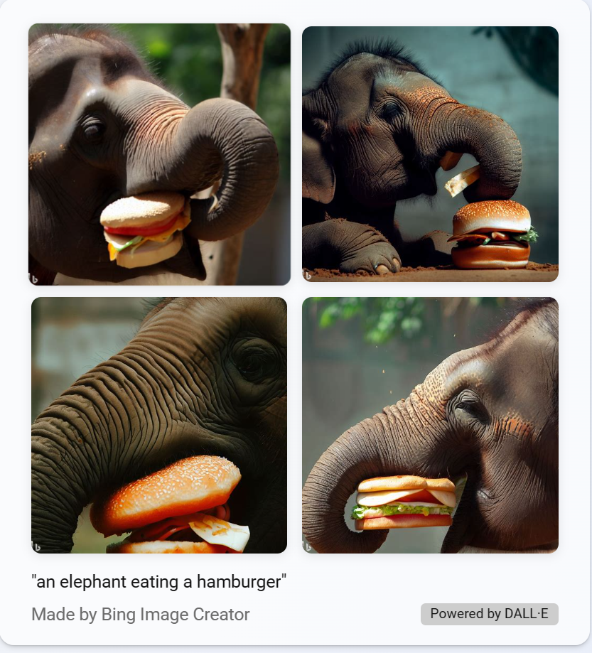

# Explorando os Recursos de IA Generativa com Copilot e OpenAI 

Explorando a IA Generativa com o Microsoft Copilot

Primeiro, acesse o Microsoft Copilot e faça login com sua conta pessoal da Microsoft. O Microsoft Copilot utiliza a IA generativa para aprimorar os resultados de busca do Bing. Isso significa que, ao contrário da busca tradicional, que retorna conteúdos já existentes, o Microsoft Copilot é capaz de gerar novas respostas baseadas em modelagem de linguagem natural e nas informações disponíveis na web.

Na parte inferior da tela, você verá uma janela com a mensagem “Pergunte-me qualquer coisa”. Ao inserir prompts nessa janela, o Copilot usa todo o histórico de conversa para retornar respostas. Por exemplo, vamos tentar fazer uma série de perguntas sobre viagens.

Digite um prompt: “Quais são 3 prós e contras de viajar no inverno?”. 

Você verá as mensagens “Procurando por:…” e “Gerando…” aparecerem antes da resposta. O modelo usa as respostas pesquisadas como informações de base para gerar respostas originais. 

Agora, vamos ver um exemplo de geração de imagem. Digite um prompt: “Crie uma imagem de um elefante comendo um hambúrguer”. Observe que uma mensagem “Vou tentar criar isso…” aparece antes do Copilot retornar uma resposta.

Na resposta, há um texto na parte inferior que diz “Alimentado por DALL-E”. DALL-E é um grande modelo de linguagem que gera imagens a partir de entrada de linguagem natural.

## Conclusão:

A IA generativa oferece muitos benefícios, também existem desafios e considerações éticas importantes a serem levados em conta, como a possibilidade de uso indevido para a criação de desinformação ou conteúdo ofensivo. É crucial que o uso da IA generativa seja usada de maneira responsável e benéfica para a sociedade.