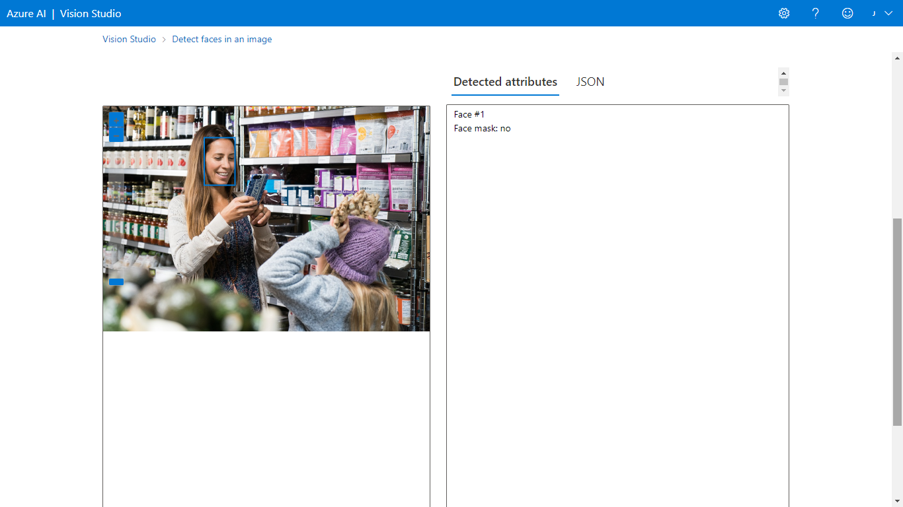

# Reconhecimento Facial e transformação de imagens em Dados

As soluções de visão geralmente exigem que a IA seja capaz de detectar rostos humanos, uma maneira de fazer isso é determinar se há algum rosto nas imagens e, em caso afirmativo, retornar as coordenadas da caixa delimitadora que mostram sua localização.

Para testar as capacidades de deteção facial do serviço Azure AI Face, utilizará o **Azure Vision Studio**

Para isso, você deve acessar o Vision Studio em https://portal.vision.cognitive.azure.com, selecionar a guia Face e depois escolher a opção "Detect Faces in an image". Em seguida, você deve ler e concordar com a política de uso de recursos e selecionar cada uma das imagens de exemplo para observar os dados de detecção de rostos retornados.

**Exemplo:**

